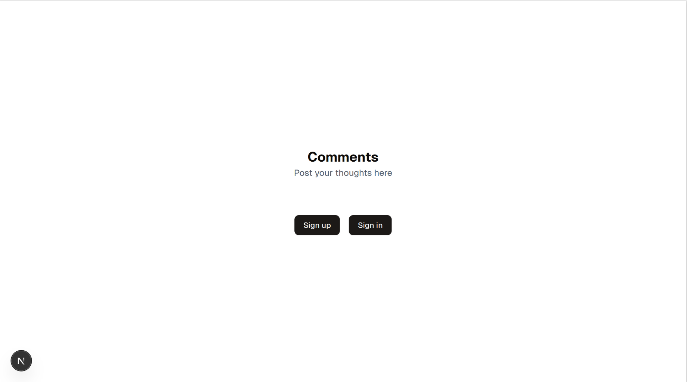

# better-auth-test

This is a personal playground for the [better-auth](https://www.better-auth.com/) authentication library using NextJS.

The application is essentially a bulletin board where one would post a comment and see comments posted by other users.

